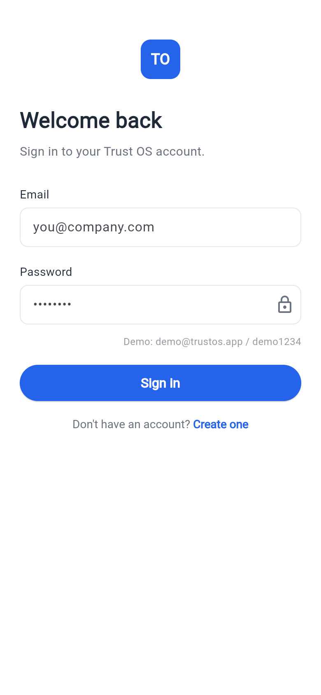
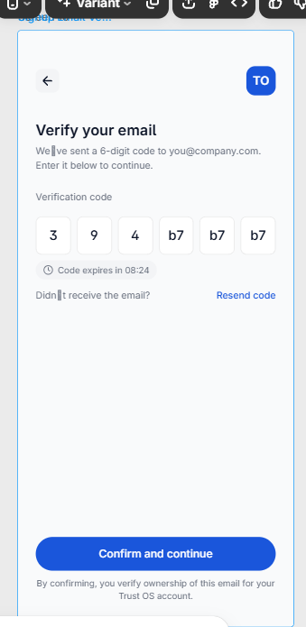
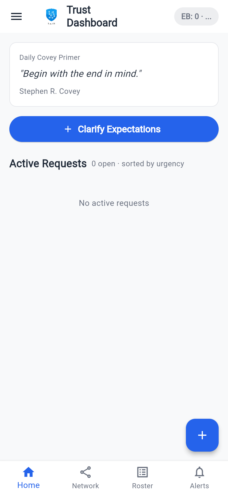
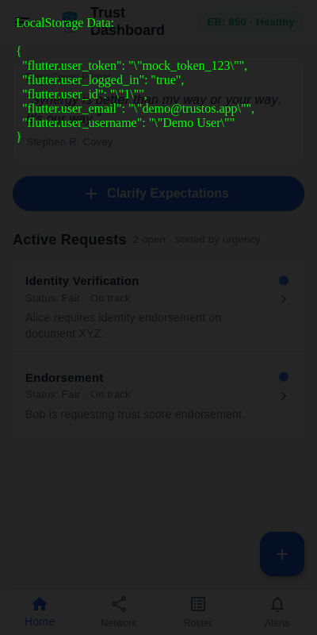
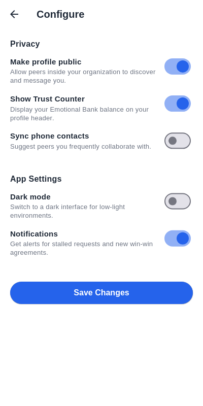
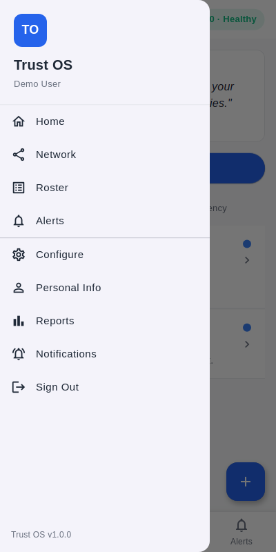

# Trust OS

**Build trust, one interaction at a time.**

Trust OS is a comprehensive mobile and web application designed for building, tracking, and managing interpersonal trust within teams and organizations. Founded on Stephen Covey's principles (especially the concept of the Emotional Bank Account), the app allows users to visually track their trust network, monitor their core relationships, and proactively manage requests based on their urgency.

## Core Interface Preview

Here is a visual overview of the Trust OS application components:

### Authentication
| Sign In | Sign Up Validation |
|---------|---------|
|  |  |

### Dashboard & State Persistence
| Dashboard Primer | LocalStorage Evidence |
|---------|---------|
|  |  |

### API Actions & Detail Navigation
| Notification Alerts | Request Details |
|---------|---------|
|  |  |

### App Architecture & Menus
| Main Drawer Menu | Settings Configuration |
|---------|---------|
|  |  |

## Core Features

- **Trust Score Dashboard**: Track your overall "Emotional Bank Account" points and health status. Gain insights from daily Covey quotes and principles.
- **Request Management**: Track and create requests ("Expectations") color-coded by urgency (Blue for Fair, Yellow for Stalled, Red for Critical). 
- **Network Map**: An interactive node map visualizing your connections and peers across the network.
- **Roster & Alerts**: Manage your network roster and stay updated on important events via filtered system and request alerts.
- **Profiles & Settings**: Fully customizable profiles, privacy, and app-wide notification settings.

## Architecture

This project is a full-stack application leveraging the following technologies:
- **Frontend**: Flutter (v3.32) & Dart (v3.8) – Compiles seamlessly to Android, iOS, and Web.
- **Backend API**: Rust – High-performance REST API built atop `actix-web` with `sqlx` driving the underlying database connections.
- **Database**: PostgreSQL
- **Development Environment Setup**: Built explicitly to run with a custom Dart HTTP Server acting as a request proxy to avoid web CORS and CanvasKit loading issues.

## Project Structure

```text
trust-builder/
├── lib/                             # Flutter Frontend Code
│   ├── main.dart                    # Application entry point
│   ├── models/                      # Dart Models (Request, Alert, NetworkNode)
│   ├── screens/                     # UI Views (Login, Home, Network, Settings, etc.)
│   ├── services/                    # API clients and business logic (Auth, TrustScore, Networks, etc.)
│   ├── theme/                       # App colors, styles, and typography mappings
│   └── widgets/                     # Reusable UI components
├── backend/                         # Rust Server Code
│   ├── Cargo.toml                   # Dependencies (actix-web, sqlx, bcrypt, etc.)
│   └── src/                         # Source files handling routing, auth, and database queries
├── serve_web.dart                   # Custom Dart proxy server for web
└── pubspec.yaml                     # Flutter package dependencies
```

## Running the Application

Because of the architectural split, the backend and frontend run as parallel processes. For this deployment, we utilize a mocked backend via `serve_web.dart` to simulate the API interactions and host the Web App.

1. **Start the Application:**
   Navigate into the root directory and run:
   ```bash
   ~/flutter/bin/dart run serve_web.dart
   ```
   *The custom Dart server will serve the optimized Flutter build on `http://localhost:5000` while proxying `/api` requests.*

> **Demo Access:** 
> You can try out the application using the pre-seeded demo account:
> **Email:** `demo@trustos.app`  |  **Password:** `demo1234`

## SOLID & Code Health Principles

The codebase favors positive logic over negative conditionals (avoiding `if (!...)` constructs where appropriate). Core business requirements—such as ApiService interactions—have been rigorously refactored into domain-isolated modules (`AuthService`, `TrustScoreService`, `NetworkService`, etc.) to adhere to single-responsibility (SOLID) principles.
